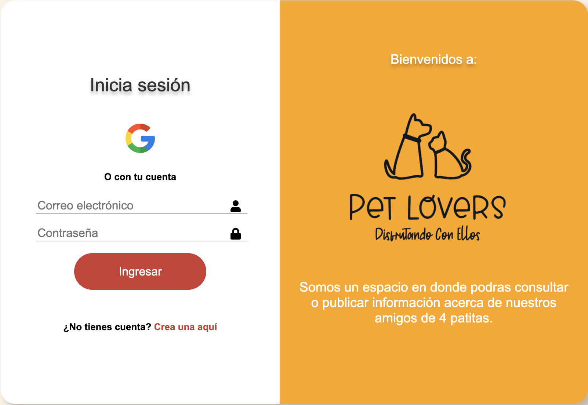

# Creando una Red Social - PET LOVERS

Colaboradoras: Katherine Cevallos, Luz María Vázquez, Ana Karen Morales.

## Índice

* [1. Definición del Producto](#1-preámbulo)
* [2. Resumen del proyecto](#2-resumen-del-proyecto)
* [3. Objetivos generales del proyecto](#3-objetivos-de-aprendizaje)
* [4. Objetivos de Aprendizaje](#4-consideraciones-generales)
* [5. Criterios de aceptación mínimos del proyecto](#5-criterios-de-aceptación-mínimos-del-proyecto)
* [6. Hacker edition](#6-hacker-edition)
* [7. Entrega](#7-entrega)
* [8. Pistas, tips y lecturas complementarias](#8-pistas-tips-y-lecturas-complementarias)

## 1. Definición del Producto

¡Bienvenido a Pet Lovers, es una plataforma de red social creada exclusivamente para personas apasionadas por las mascotas! Aquí, los usuarios pueden conectarse con otros amantes de los animales, compartir experiencias, acceder a recursos y encontrar todo lo necesario para cuidar y disfrutar al máximo la compañía de sus mascotas. Sea cual sea tu mascota, este es el lugar perfecto para intercambiar conocimientos y amor por los animales.

## 2. Resumen del proyecto

Características principales de Pet Lovers:

Pet Lovers ofrece una comunidad en línea para amantes de mascotas donde puedes compartir publicaciones,historias y recibir inspiración. Ofrece consejos prácticos y recomendaciones de cuidado animal de expertos. También brinda ayuda para mascotas perdidas, conectando a la comunidad para reunir a las mascotas con sus dueños. Además, proporciona información sobre proveedores de alimentos y productos de calidad, anuncia eventos locales para que las mascotas socialicen, promueve la adopción responsable y apoya un estilo de vida saludable para tus animales a través de ejercicios, alimentación y cuidados veterinarios.

## 3. Objetivos generales del proyecto

A continuación se detallan las acciones que el usuario podrá realizar en la red social "Pet Lovers":

* Se desarrolló una SPA con temática de red social para mascotas.
* El usuario podrá crear su cuenta desde Google authentication.
* El usuario ingresará con su correo y contraseña.
* El usuario podrá crear su cuenta desde el formulario de registro para acceder a la red social.
* El usuario podrá visualizar su foto de perfil y nombre en el feed, cuando haya ingresado desde Google Authentication.
* El usuario podrá visualizar una imagen predeterminada cuando haya ingresado por email y contraseña.
* El usuario podrá crear una publicación.
* El usuario podrá visualizar todas las publicaciones de manera ordenada por fecha de creación.
* El usuario podrá eliminar y editar una publicación que sea de su autoría.
* El usuario podrá dar like a las publicaciones que desee.
* El usuario podrá cerrar sesión y será redireccionado al módulo de Log in.

## 4. Objetivos de aprendizaje

Reflexiona y luego marca los objetivos que has llegado a entender y aplicar en tu proyecto. Piensa en eso al decidir tu estrategia de trabajo.

### HTML

- [ ] **Uso de HTML semántico**

  

Links

  * [HTML semántico](https://curriculum.laboratoria.la/es/topics/html/02-html5/02-semantic-html)
  * [Semantics - MDN Web Docs Glossary](https://developer.mozilla.org/en-US/docs/Glossary/Semantics#Semantics_in_HTML)

### CSS

- [ ] **Uso de selectores de CSS**

  

Links

  * [Intro a CSS](https://curriculum.laboratoria.la/es/topics/css/01-css/01-intro-css)
  * [CSS Selectors - MDN](https://developer.mozilla.org/es/docs/Web/CSS/CSS_Selectors)

- [ ] **Modelo de caja (box model): borde, margen, padding**

  

Links

  * [Box Model & Display](https://curriculum.laboratoria.la/es/topics/css/01-css/02-boxmodel-and-display)
  * [The box model - MDN](https://developer.mozilla.org/en-US/docs/Learn/CSS/Building_blocks/The_box_model)
  * [Introduction to the CSS box model - MDN](https://developer.mozilla.org/en-US/docs/Web/CSS/CSS_Box_Model/Introduction_to_the_CSS_box_model)
  * [CSS display - MDN](https://developer.mozilla.org/pt-BR/docs/Web/CSS/display)
  * [display - CSS Tricks](https://css-tricks.com/almanac/properties/d/display/)

- [ ] **Uso de flexbox en CSS**

  

Links

  * [A Complete Guide to Flexbox - CSS Tricks](https://css-tricks.com/snippets/css/a-guide-to-flexbox/)
  * [Flexbox Froggy](https://flexboxfroggy.com/#es)
  * [Flexbox - MDN](https://developer.mozilla.org/en-US/docs/Learn/CSS/CSS_layout/Flexbox)

- [ ] **Uso de CSS Grid Layout**

  

Links

  * [A Complete Guide to Grid - CSS Tricks](https://css-tricks.com/snippets/css/complete-guide-grid/)
  * [Grids - MDN](https://developer.mozilla.org/en-US/docs/Learn/CSS/CSS_layout/Grids)

### Web APIs

- [ ] **Uso de selectores del DOM**

  

Links

  * [Manipulación del DOM](https://curriculum.laboratoria.la/es/topics/browser/02-dom/03-1-dom-methods-selection)
  * [Introducción al DOM - MDN](https://developer.mozilla.org/es/docs/Web/API/Document_Object_Model/Introduction)
  * [Localizando elementos DOM usando selectores - MDN](https://developer.mozilla.org/es/docs/Web/API/Document_object_model/Locating_DOM_elements_using_selectors)

- [ ] **Manejo de eventos del DOM (listeners, propagación, delegación)**

  

Links

  * [Introducción a eventos - MDN](https://developer.mozilla.org/es/docs/Learn/JavaScript/Building_blocks/Events)
  * [EventTarget.addEventListener() - MDN](https://developer.mozilla.org/es/docs/Web/API/EventTarget/addEventListener)
  * [EventTarget.removeEventListener() - MDN](https://developer.mozilla.org/es/docs/Web/API/EventTarget/removeEventListener)
  * [El objeto Event](https://developer.mozilla.org/es/docs/Web/API/Event)

- [ ] **Manipulación dinámica del DOM**

  

Links

  * [Introducción al DOM](https://developer.mozilla.org/es/docs/Web/API/Document_Object_Model/Introduction)
  * [Node.appendChild() - MDN](https://developer.mozilla.org/es/docs/Web/API/Node/appendChild)
  * [Document.createElement() - MDN](https://developer.mozilla.org/es/docs/Web/API/Document/createElement)
  * [Document.createTextNode()](https://developer.mozilla.org/es/docs/Web/API/Document/createTextNode)
  * [Element.innerHTML - MDN](https://developer.mozilla.org/es/docs/Web/API/Element/innerHTML)
  * [Node.textContent - MDN](https://developer.mozilla.org/es/docs/Web/API/Node/textContent)

- [ ] **Ruteado (History API, evento hashchange, window.location)**

  

Links

  * [Manipulando el historial del navegador - MDN](https://developer.mozilla.org/es/docs/DOM/Manipulando_el_historial_del_navegador)

### JavaScript

- [ ] **Arrays (arreglos)**

  

Links

  * [Arreglos](https://curriculum.laboratoria.la/es/topics/javascript/04-arrays)
  * [Array - MDN](https://developer.mozilla.org/es/docs/Web/JavaScript/Reference/Global_Objects/Array/)
  * [Array.prototype.sort() - MDN](https://developer.mozilla.org/es/docs/Web/JavaScript/Reference/Global_Objects/Array/sort)
  * [Array.prototype.forEach() - MDN](https://developer.mozilla.org/es/docs/Web/JavaScript/Reference/Global_Objects/Array/forEach)
  * [Array.prototype.map() - MDN](https://developer.mozilla.org/es/docs/Web/JavaScript/Reference/Global_Objects/Array/map)
  * [Array.prototype.filter() - MDN](https://developer.mozilla.org/es/docs/Web/JavaScript/Reference/Global_Objects/Array/filter)
  * [Array.prototype.reduce() - MDN](https://developer.mozilla.org/es/docs/Web/JavaScript/Reference/Global_Objects/Array/Reduce)

- [ ] **Objetos (key, value)**

  

Links

  * [Objetos en JavaScript](https://curriculum.laboratoria.la/es/topics/javascript/05-objects/01-objects)

- [ ] **Diferenciar entre tipos de datos primitivos y no primitivos**

- [ ] **Variables (declaración, asignación, ámbito)**

  

Links

  * [Valores, tipos de datos y operadores](https://curriculum.laboratoria.la/es/topics/javascript/01-basics/01-values-variables-and-types)
  * [Variables](https://curriculum.laboratoria.la/es/topics/javascript/01-basics/02-variables)

- [ ] **Uso de condicionales (if-else, switch, operador ternario, lógica booleana)**

  

Links

  * [Estructuras condicionales y repetitivas](https://curriculum.laboratoria.la/es/topics/javascript/02-flow-control/01-conditionals-and-loops)
  * [Tomando decisiones en tu código — condicionales - MDN](https://developer.mozilla.org/es/docs/Learn/JavaScript/Building_blocks/conditionals)

- [ ] **Uso de bucles/ciclos (while, for, for..of)**

  

Links

  * [Bucles (Loops)](https://curriculum.laboratoria.la/es/topics/javascript/02-flow-control/02-loops)
  * [Bucles e iteración - MDN](https://developer.mozilla.org/es/docs/Web/JavaScript/Guide/Loops_and_iteration)

- [ ] **Funciones (params, args, return)**

  

Links

  * [Funciones (control de flujo)](https://curriculum.laboratoria.la/es/topics/javascript/02-flow-control/03-functions)
  * [Funciones clásicas](https://curriculum.laboratoria.la/es/topics/javascript/03-functions/01-classic)
  * [Arrow Functions](https://curriculum.laboratoria.la/es/topics/javascript/03-functions/02-arrow)
  * [Funciones — bloques de código reutilizables - MDN](https://developer.mozilla.org/es/docs/Learn/JavaScript/Building_blocks/Functions)

- [ ] **Pruebas unitarias (unit tests)**

  

Links

  * [Empezando con Jest - Documentación oficial](https://jestjs.io/docs/es-ES/getting-started)

- [ ] **Pruebas asíncronas**

  

Links

  * [Tests de código asincrónico con Jest - Documentación oficial](https://jestjs.io/docs/es-ES/asynchronous)

- [ ] **Uso de mocks y espías**

  

Links

  * [Manual Mocks con Jest - Documentación oficial](https://jestjs.io/docs/es-ES/manual-mocks)

- [ ] **Módulos de ECMAScript (ES Modules)**

  

Links

  * [import - MDN](https://developer.mozilla.org/es/docs/Web/JavaScript/Reference/Statements/import)
  * [export - MDN](https://developer.mozilla.org/es/docs/Web/JavaScript/Reference/Statements/export)

- [ ] **Uso de linter (ESLINT)**

- [ ] **Uso de identificadores descriptivos (Nomenclatura y Semántica)**

- [ ] **Diferenciar entre expresiones (expressions) y sentencias (statements)**

- [ ] **Callbacks**

  

Links

  * [Función Callback - MDN](https://developer.mozilla.org/es/docs/Glossary/Callback_function)

- [ ] **Promesas**

  

Links

  * [Promise - MDN](https://developer.mozilla.org/es/docs/Web/JavaScript/Reference/Global_Objects/Promise)
  * [How to Write a JavaScript Promise - freecodecamp (en inglés)](https://www.freecodecamp.org/news/how-to-write-a-javascript-promise-4ed8d44292b8/)

### Control de Versiones (Git y GitHub)

- [ ] **Git: Instalación y configuración**

- [ ] **Git: Control de versiones con git (init, clone, add, commit, status, push, pull, remote)**

- [ ] **Git: Integración de cambios entre ramas (branch, checkout, fetch, merge, reset, rebase, tag)**

- [ ] **GitHub: Creación de cuenta y repos, configuración de llaves SSH**

- [ ] **GitHub: Despliegue con GitHub Pages**

  

Links

  * [Sitio oficial de GitHub Pages](https://pages.github.com/)

- [ ] **GitHub: Colaboración en Github (branches | forks | pull requests | code review | tags)**

- [ ] **GitHub: Organización en Github (projects | issues | labels | milestones | releases)**

### Centrado en el usuario

- [ ] **Diseñar y desarrollar un producto o servicio poniendo a las usuarias en el centro**

### Diseño de producto

- [ ] **Crear prototipos de alta fidelidad que incluyan interacciones**

- [ ] **Seguir los principios básicos de diseño visual**

### Investigación

- [ ] **Planear y ejecutar testeos de usabilidad de prototipos en distintos niveles de fidelidad**

  

Links

  * [Intro a testeos usabilidad](https://coda.io/@bootcamp-laboratoria/contenido-ux/test-de-usabilidad-15)
  * [Pruebas con Usuarios 1 — ¿Qué, cuándo y para qué testeamos?](https://eugeniacasabona.medium.com/pruebas-con-usuarios-1-qu%C3%A9-cu%C3%A1ndo-y-para-qu%C3%A9-testeamos-7c3a89b4b5e7)

### Firebase

- [ ] **Firebase Auth**

  

Links

  * [Primeros pasos con Firebase Authentication en sitios web - Documentación oficial](https://firebase.google.com/docs/auth/web/start?hl=es)
  * [Administra usuarios en Firebase (onAuthStateChanged)](https://firebase.google.com/docs/auth/web/manage-users?hl=es#get_the_currently_signed-in_user)

- [ ] **Firestore**

  

Links

  * [Firestore - Documentación oficial](https://firebase.google.com/docs/firestore?hl=es)
  * [Reglas de seguridad de Firestore - Documentación oficial](https://firebase.google.com/docs/rules?hl=es)
  * [Obtén actualizaciones en tiempo real con Cloud Firestore - Documentación oficial](https://firebase.google.com/docs/firestore/query-data/listen?hl=es)

## 4. Consideraciones generales

* Este proyecto se debe trabajar en equipos de tres.

* El rango de tiempo estimado para completar el proyecto es de 4 a 5 Sprints.

* La lógica del proyecto debe estar implementada completamente en JavaScript
  (ES6+), HTML y CSS :smiley:. Para este proyecto **no está permitido** utilizar
  _frameworks_ o librerías de CSS y JS.

* La división y organización del trabajo debe permitir, sin excepciones, que
  **cada integrante** del equipo practique el aprendizaje de todo lo involucrado
  en **cada historia**. _No se dividan el trabajo como en una fábrica._
  - ¿Hasta acá has avanzado en tus proyectos con cierta fluidez y sin mayores
    problemas? Sé generosa con tus compañeras, permíteles aprender y practicar
    sin restricciones, aunque tome un poco más de tiempo. Aproveha de
    _coachearlas_, de hacer _pair programming_, una de las mejores maneras de
    aprender es explicando verbalmente.

  - ¿Se te está haciendo difícil y te cuesta un poco más avanzar? No te quedes
    con las partes "fáciles" del proyecto, conversa, negocia, exige tu oportunidad
    para practicar y aprender lo que se te hace más difícil.

* Solamente pueden trabajar en una única historia por vez, no pueden avanzar a
  la siguiente sin haber completado la anterior. La historia se completa cuando
  se cumplen **todos** sus Criterios de Aceptación + **toda** su Definición
  de Terminado.

Para comenzar tendrás que hacer un _fork_ y _clonar_ este repositorio.

## 5. Criterios de aceptación 

### 5.1 Definición del producto

* ¿Quiénes son los principales usuarios de producto?

Personas de todas las edades que puedan acceder a esta red social de ayuda para los amantes de los animales.

* ¿Qué problema resuelve el producto / para qué le servirá a estos usuarios?

Dentro de las características más importantes están:

Ayudar a las personas a encontrar a sus mascotas perdidas.

Ofrecer servicios relevantes a la tenencia responsable de mascotas.

### 5.2 Historias de usuario

**HU-07 Crear inicio de sesión de usuario a través de su cuenta de Google**

* **Criterios de Aceptación:** 

El usuario podrá dar clic en el icono de Google y con ello podrá acceder al sistema y ver la sección de publicaciones. Siempre y cuando tenga una cuenta disponible en Google podrá acceder al feed. 

**HU-07 Enlace de crear cuenta desde login**

* **Criterios de Aceptación:** 

El usuario podra dar clic en CREAR CUENTA AQUI.

Al dar click debera mostrarse la pantalla de crear cuenta.

**HU-09 Registrarse con un nuevo correo electrónico**

* **Criterios de Aceptación:** 

El usuario podrá registrarse con su correo y contraseña dando clic en el botón crear cuenta, en caso de que el correo ya se encuentre registrado no podrá ingresar y le permitirá ir a la página de login.

 Validar el campo de contraseña cuando no coinciden y mostrar un mensaje de “Las contraseñas no coinciden“.

Validar el campo de contraseña  deberá tener al menos 6 caracteres sino mostrar mensaje “La contraseña debe tener al menos 6 caracteres“.

Validar el campo de correo electronico no se puede repetir con un correo ya registrado sino mostrar mensaje “El correo ya está registrado”.

Desaparecer los mensajes cuando ya hay ingresado los datos correctos. 

**HU-10 Crear publicación en el Feed.**

* **Criterios de Aceptación:** 

El usuario podrá crear una nueva publicación en tiempo real y observarla en el feed.

Al publicar, se debe validar que exista contenido en la casilla de texto.

**HU-11 Mostrar todas las publicaciones en el Feed por fecha de creación.**

* **Criterios de Aceptación:** 

El usuario podrá ver todas las publicaciones creadas en el feed.

Las publicaciones se mostrarán en el feed basándose en su fecha de creación.

**HU-12 Eliminar publicación.**

* **Criterios de Aceptación:** 

Se debe poder eliminar un post específico.

Al dar click para eliminar un post, se mostrará un modal que pida la confirmación para eliminar dicho post.

Dentro del modal, al dar click en aceptar, se eliminará dicho post y dejará de aparecer en el feed.

Dentro del modal, al dar click en cancelar, se revertirá dicha acción.

Únicamente el usuario que crea el post es capaz de eliminarlo.

**HU-13 Editar publicación.**

* **Criterios de Aceptación:** 

Al dar click para editar un post, se mostrará el post seleccionado, donde se debe cambiar el texto por un input que permita editar el texto y luego guardar los cambios.

Al guardar los cambios debe cambiar de vuelta a un texto normal pero con la información editada sobre el feed actualizado.

Al dar click en Cancelar, se revertirá la acción y el post se mostrará intacto.

Únicamente el usuario que crea el post es capaz de editarlo.

**HU-13.1 Botón cancelar para editar publicación**

* **Criterios de Aceptación:** 

El usuario final dara clic en el botón cancelar inmediatamente la publicación mantendrá su texto original sin modificaciones.

**HU-13.2 Botón guardar para editar publicación**

* **Criterios de Aceptación:** 

Al dar click en el botón GUARDAR la publicación se actualizara y se guardara en firebase.

**HU-14 Dar like o dislike a una publación.**

Se registrará un like por usuario en cada publicación.

Se registrará la eliminación o colocación del like en el contador de likes del feed.

**HU-15 Cerrar sesión del Usuario.**

* **Criterios de Aceptación:** 

Al dar click en el ícono de Logout, debería cerrarse la sesión del usuario y no mostrar más el feed.

Al cerrar sesión, se debería mostrar la página de Login.

**HU-16 Mostrar la fecha de publicación de cada post.**

* **Criterios de Aceptación:** 

Se debe mostrar la fecha de creación de cada publicación en el feed.

**HU-17 Mostrar datos de usuario en el feed.**

* **Criterios de Aceptación:** 

Una vez que el usuario se encuentre registrado, el usuario podrá visualizar en el feed su foto de perfil y nombre. 

### 5.3 Diseño de la Interfaz de Usuario (prototipo de alta fidelidad)

Prototipo de baja fidelidad para Inicio y registro de sesión del Usuario.

Prototipo de baja fidelidad para componente Feed del Usuario incluido el registro e inicio de sesión.

.png)

### 5.4 Diseño de la Interfaz de Usuario (prototipo de alta fidelidad)

Prototipo de alta fidelidad para Inicio de sesión del Usuario.

Prototipo de alta fidelidad para Registro de sesión de Usuario.

Prototipo de alta fidelidad para componente Feed del Usuario.

#### Creación de cuenta de usuario e inicio de sesión

* _Login_ con Firebase:
  - Para el _login_ y las publicaciones en el muro puedes utilizar [Firebase](https://firebase.google.com/products/database/)
  - Creación de cuenta de acceso y autenticación con cuenta de correo y
    contraseña, y también con una cuenta de Google.
* Validaciones:
  - Solamente se permite el acceso a usuarios con cuentas válidas.
  - No pueden haber usuarios repetidos.
  - La cuenta de usuario debe ser un correo electrónico válido.
  - Lo que se escriba en el campo (_input_) de contraseña debe ser secreto.
* Comportamiento:
  - Al enviarse el formulario de registro o inicio de sesión, debe validarse.
  - Si hay errores, se deben mostrar mensajes descriptivos para ayudar al
  usuario a corregirlos.

#### Muro/timeline

* Validaciones:
  - Al publicar, se debe validar que exista contenido en el _input_.
* Comportamiento:
  - Al recargar la aplicación, se debe verificar si el usuario está _logueado_
    antes de mostrar contenido.
  - Poder publicar un _post_.
  - Poder dar y quitar _like_ a una publicación. Máximo uno por usuario.
  - Llevar un conteo de los _likes_.
  - Poder eliminar un post específico.
  - Pedir confirmación antes de eliminar un _post_.
  - Al dar _click_ para editar un _post_, debe cambiar el texto por un _input_
    que permita editar el texto y luego guardar los cambios.
  - Al guardar los cambios debe cambiar de vuelta a un texto normal pero con la
    información editada.
  - Al recargar la página debo de poder ver los textos editados.

### 5.4 Consideraciones técnicas Front-end

* Separar la manipulación del DOM de la lógica (Separación de responsabilidades).
* Contar con múltiples vistas. Para esto, tu aplicación debe ser una
 [Single Page Application (SPA)](https://es.wikipedia.org/wiki/Single-page_application)
* Alterar y persistir datos. Los datos que agregues o modifiques deberán
  persistir a lo largo de la aplicación. Te recomendamos que uses
  [Firebase](https://firebase.google.com/) para eso también.

#### Pruebas unitarias (unit tests)

* Recuerda que no hay un _setup_ de **tests** definido, dependerá de
  la estructura de tu proyecto. Algo que no debes de olvidar es pensar en éstas
  pruebas, te pueden ayudar a definir la estructura y nomenclatura de tu lógica.

* Los tests unitarios deben cubrir un mínimo del 70% de _statements_, _functions_,
  _lines_, y _branches_.

***

## 6. Pistas, tips y Lecturas complementarias

Súmate al canal de Slack
[#project-social-network](https://claseslaboratoria.slack.com/archives/C03SE63GFJQ)
para conversar y pedir ayuda del proyecto.

### Mobile first

El concepto de [_mobile first_](https://www.mediaclick.es/blog/diseno-web-responsive-design-y-la-importancia-del-mobile-first/)
hace referencia a un proceso de diseño y desarrollo donde partimos de cómo se ve
y cómo funciona la aplicación en un dispositivo móvil primero, y más adelante se
ve como adaptar la aplicación a pantallas progresivamente grandes y
características específicas del entorno desktop. Esto es en contraposición al
modelo tradicional, donde primero se diseñaban los websites (o webapps) para
desktop y después se trataba de _arrugar_ el diseño para que entre en pantallas
más chicas. La clave acá es asegurarse de que desde el principio diseñan usando
la vista _responsive_ de las herramientas de desarrollador (developer tools) del
navegador. De esa forma, partimos de cómo se ve y comporta la aplicación en una
pantalla y entorno móvil.

### Múltiples vistas

En proyectos anteriores nuestras aplicaciones habían estado compuestas de una
sola _vista_ principal (una sóla _página_). En este proyecto se introduce la
necesidad de tener que dividir nuestra interfaz en varias _vistas_ o _páginas_
y ofrecer una manera de navegar entre estas vistas. Este problema se puede
afrontar de muchas maneras: con archivos HTML independientes (cada uno con su
URL) y links tradicionales, manteniendo estado en memoria y rederizando
condicionalmente (sin refrescar la página), [manipulando el historial del
navegador](https://developer.mozilla.org/es/docs/DOM/Manipulando_el_historial_del_navegador)
con [`window.history`](https://developer.mozilla.org/es/docs/Web/API/Window/history).
En este proyecto te invitamos a explorar opciones y decidir una opción
de implementación.

### Escritura de datos

En los proyectos anteriores hemos consumido (leído) datos, pero todavía no
habíamos escrito datos (salvar cambios, crear datos, borrar, ...). En este
proyecto tendrás que crear (salvar) nuevos datos, así como leer, actualizar y
modificar datos existentes. Estos datos se podrán guardar de forma remota
usando [Firebase](https://firebase.google.com/).

Para usar Firebase hay que crear un proyecto en la consola de Firebase e
instalar la dependencia `firebase` utilizando `npm`.
Lee [las instrucciones paso a paso aqui](https://firebase.google.com/docs/web/setup).

Otras:

* [Modulos: Export](https://developer.mozilla.org/es/docs/Web/JavaScript/Referencia/Sentencias/export)
* [Modulos: Import](https://developer.mozilla.org/es/docs/Web/JavaScript/Referencia/Sentencias/import)
* [Diseño web, responsive design y la importancia del mobile first - Media Click](https://www.mediaclick.es/blog/diseno-web-responsive-design-y-la-importancia-del-mobile-first/)
* [Mobile First: el enfoque actual del diseño web móvil - 1and1](https://www.1and1.es/digitalguide/paginas-web/diseno-web/mobile-first-la-nueva-tendencia-del-diseno-web/)
* [Mobile First - desarrolloweb.com](https://desarrolloweb.com/articulos/mobile-first-responsive.html)
* [Mobile First Is NOT Mobile Only - Nielsen Norman Group](https://www.nngroup.com/articles/mobile-first-not-mobile-only/)
