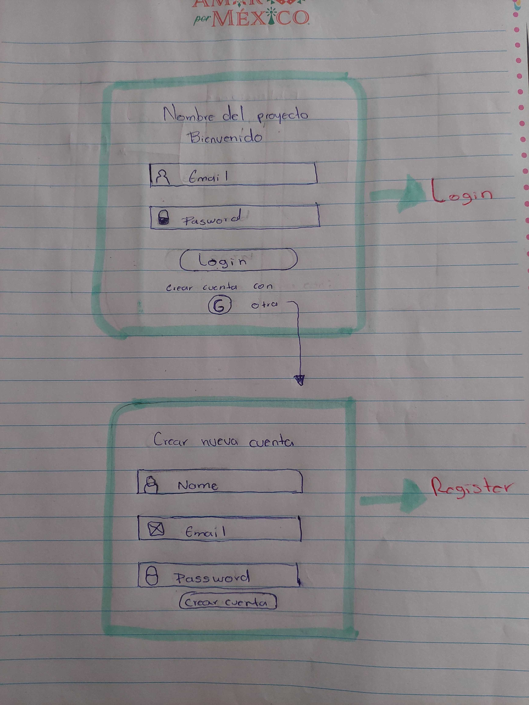
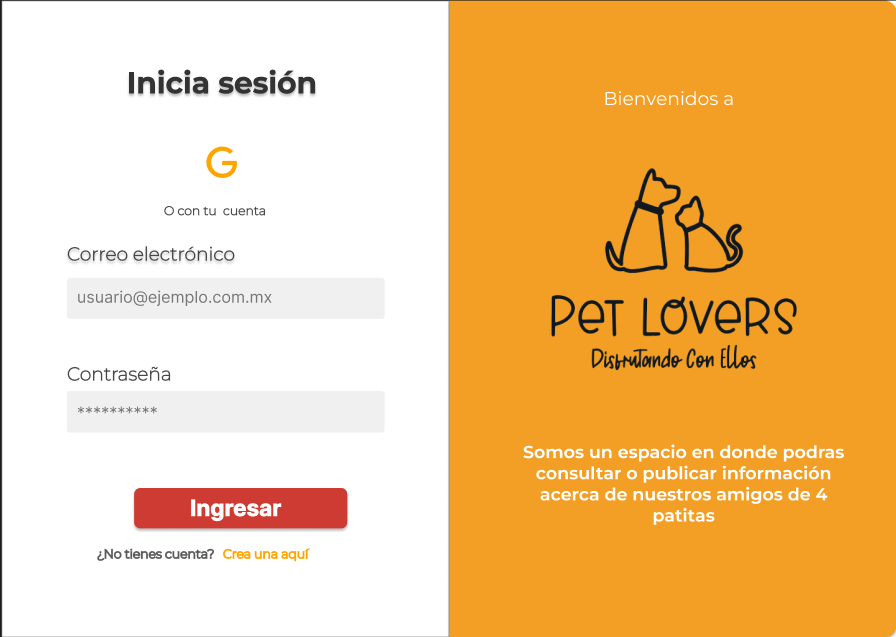
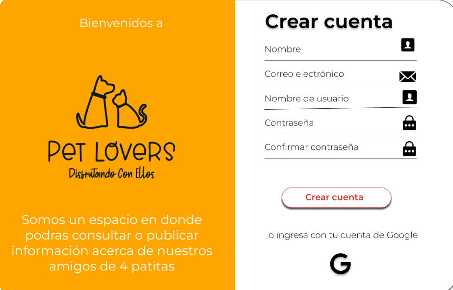
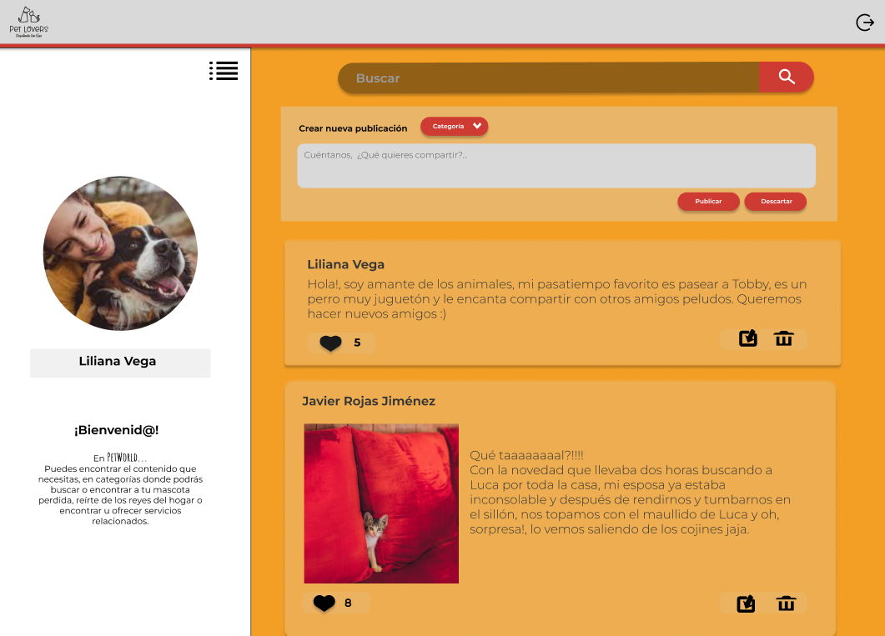

# Creando una Red Social - PET LOVERS

Colaboradoras: Katherine Cevallos, Luz María Vázquez, Ana Karen Morales.

## Índice

* [1. Definición del Producto](#1-preámbulo)
* [2. Resumen del proyecto](#2-resumen-del-proyecto)
* [3. Objetivos generales del proyecto](#3-objetivos-de-aprendizaje)
* [4. Objetivos de Aprendizaje](#4-consideraciones-generales)
* [5. Criterios de aceptación mínimos del proyecto](#5-criterios-de-aceptación-mínimos-del-proyecto)
* [6. Hacker edition](#6-hacker-edition)
* [7. Entrega](#7-entrega)
* [8. Pistas, tips y lecturas complementarias](#8-pistas-tips-y-lecturas-complementarias)

## 1. Definición del Producto

¡Bienvenido a Pet Lovers, la red social creada exclusivamente para personas apasionadas por las mascotas! Ya seas dueño de un tierno cachorro, un gato curioso o cualquier otra adorable criatura, este es el lugar perfecto para conectarte con otros amantes de los animales y encontrar todo lo que necesitas para cuidar y disfrutar al máximo de la compañía de tus queridas mascotas.

## 2. Resumen del proyecto

Características principales de Pet Lovers:

Comunidad de Amantes de las Mascotas: Únete a una comunidad en línea de personas que comparten tu amor por los animales. Comparte historias de tus mascotas, y encuentra inspiración en las experiencias de otros propietarios.
Consejos y Recomendaciones: En Pet Lovers, encontrarás una abundancia de consejos prácticos y recomendaciones sobre el cuidado de mascotas. Nuestra comunidad está llena de expertos y personas con experiencia que estarán encantados de compartir su sabiduría contigo.
Ayuda para Mascotas Perdidas: Si has perdido a tu querida mascota, no estás solo. Publica detalles sobre tu mascota perdida y su última ubicación conocida, y permite que la comunidad te ayude en la búsqueda para reunirte con tu peludo amigo.
Proveedores de Alimentos y Productos para Mascotas: Encuentra proveedores locales y en línea de alimentos saludables y productos de alta calidad para tus mascotas. Lee reseñas, comparte tus recomendaciones y descubre nuevos productos que harán la vida de tus animales más feliz.
Eventos y Encuentros: Mantente informado sobre eventos y encuentros locales para amantes de las mascotas. Organiza paseos grupales, encuentros en parques para perros y otras actividades divertidas para que tus mascotas socialicen y hagan nuevos amigos peludos.
Adopción y Rescate: Fomentamos la adopción responsable y apoyamos a refugios y organizaciones de rescate. Encuentra mascotas que necesiten un hogar amoroso y ayuda a difundir su búsqueda de una familia cariñosa.
Estilo de Vida Saludable: En Pet Lovers, creemos en un estilo de vida saludable para nuestras mascotas. Encuentra información sobre ejercicios, alimentación, entrenamiento y cuidados veterinarios para mantener a tus animales en óptimas condiciones. 

## 3. Objetivos generales del proyecto

A continuación se detallan las acciones que el usuario podrá realizar en la red social "Pet Lovers":

* Se desarrolló una SPA con temática de red social para mascotas.
* El usuario podrá crear su cuenta desde Google authentication.
* El usuario ingresará con su correo y contraseña.
* El usuario podrá crear su cuenta desde el formulario de registro para acceder a la red social.
* El usuario podrá visualizar su foto de perfil y nombre en el feed, cuando haya ingresado desde Google Authentication.
* El usuario podrá visualizar una imagen predeterminada cuando haya ingresado por email y contraseña.
* El usuario podrá crear una publicación.
* El usuario podrá visualizar todas las publicaciones de manera ordenada por fecha de creación.
* El usuario podrá eliminar y editar una publicación que sea de su autoría.
* El usuario podrá dar like a las publicaciones que desee.
* El usuario podrá cerrar sesión y será redireccionado al módulo de Log in.

## 4. Objetivos de aprendizaje

El proyecto Pet Lovers fue desarrollado entorno a las siguientes tecnologias; Java script, html,css,firebase etc..
de cada uno de ellos se obtuvo un aprendizaje para poder concluir el proyecto a continuacion se detalla sobre lo aprendido.

### HTML
- **Uso de HTML semántico**
- Desarrollar la maquetación HTML en concordancia con el prototipo en Figma.

### CSS
- Uso de selectores de CSS para dar estilos y formato al contenido
- Modelo de caja
- Uso de flexbox en CSS

### Web APIs
- Uso de selectores del DOM.
Se utilizaron para seleccionar y acceder cada elemento de la pagina web .
+ Listeners: Se utilizaron para detectar y responder a eventos que ocurren en los elementos HTML de la página web.
    + EventTarget.addEventListener()
    +  El objeto Event

### Manipulación dinámica del DOM
+ Se utilizó para crear, editar o modificar los elemento del DOM.
    + Node.appendChild()
    + Document.createElement()
    + Element.innerHTML
    + Node.textContent
    + Element.classList
    + Element.value
    + Event.target
### Enrutamiento
+ Estos fueron los elementos que se utilizaron par el enrutamiento.
   + History API
   + window.location.pathname;
   + evento hashchange
   + evento popstate
   + evento pushState
   + window.dispatchEvent
### JavaScript
Estos fueron algunos de los conceptos o definiciones que se investigaron e implementaron en el proyecto.
- **Arrays (arreglos)**
- **Objetos (key, value)**
- **Datos primitivos y no primitivos**
- **Variables (declaración, asignación, ámbito)**
-**Condicionales (if-else, operador ternario, lógica booleana)**
- **Bucles/ciclos (for,forEach)**
- **Funciones (params, args, return)**
- **Pruebas unitarias (unit tests con jest DOM)**
-**Pruebas asíncronas**
- **Módulos de ECMAScript (ES Modules)**
- **Uso de linter (ESLINT)**
- **Uso de identificadores descriptivos (Nomenclatura y Semántica)**
- **Diferenciar entre expresiones (expressions) y sentencias (statements)**
-**Callbacks**
- **Promesas**
### Control de Versiones (Git y GitHub)
+ Git flow: Se utlizo este modelo de ramificación ya que nos facilita la organización del trabajo y el seguimiento de las diferentes etapas de desarrollo.
  + Git: Control de versiones con git (init, clone, add, commit, status, push, pull, remote)**
  + **Git: Integración de cambios entre ramas ( branch, checkout, merge, reset)**
  + **GitHub: Colaboración en Github (branches | forks | pull requests, fork, jgh pages)**
 + **GitHub: Despliegue con GitHub Pages**
### Centrado en el usuario
 **Diseñar y desarrollar un producto o servicio poniendo a las usuarias en el centro**
### Diseño de producto
-**Crear prototipos de alta fidelidad que incluyan interacciones**
-**Seguir los principios básicos de diseño visual**
### Firebase
-  **Firebase Auth**:
  Se utilizo para el logeo del usuario final
- **Firestore**:
Se utilizo para el almacenamiento de datos y la iImplemntacion de los metodos de firebase (CRUD)
   +  create
   +  Read
   +  Update
   +  Delete

### 5 Historias de usuario

**HU-07 Crear inicio de sesión de usuario a través de su cuenta de Google**

* **Criterios de Aceptación:** 

El usuario podrá dar clic en el icono de Google y con ello podrá acceder al sistema y ver la sección de publicaciones. Siempre y cuando tenga una cuenta disponible en Google podrá acceder al feed. 

**HU-07 Enlace de crear cuenta desde login**

* **Criterios de Aceptación:** 

El usuario podra dar clic en CREAR CUENTA AQUI.

Al dar click debera mostrarse la pantalla de crear cuenta.

**HU-09 Registrarse con un nuevo correo electrónico**

* **Criterios de Aceptación:** 

El usuario podrá registrarse con su correo y contraseña dando clic en el botón crear cuenta, en caso de que el correo ya se encuentre registrado no podrá ingresar y le permitirá ir a la página de login.

 Validar el campo de contraseña cuando no coinciden y mostrar un mensaje de “Las contraseñas no coinciden“.

Validar el campo de contraseña  deberá tener al menos 6 caracteres sino mostrar mensaje “La contraseña debe tener al menos 6 caracteres“.

Validar el campo de correo electronico no se puede repetir con un correo ya registrado sino mostrar mensaje “El correo ya está registrado”.

Desaparecer los mensajes cuando ya hay ingresado los datos correctos. 

**HU-10 Crear publicación en el Feed.**

* **Criterios de Aceptación:** 

El usuario podrá crear una nueva publicación en tiempo real y observarla en el feed.

Al publicar, se debe validar que exista contenido en la casilla de texto.

**HU-11 Mostrar todas las publicaciones en el Feed por fecha de creación.**

* **Criterios de Aceptación:** 

El usuario podrá ver todas las publicaciones creadas en el feed.

Las publicaciones se mostrarán en el feed basándose en su fecha de creación.

**HU-12 Eliminar publicación.**

* **Criterios de Aceptación:** 

Se debe poder eliminar un post específico.

Al dar click para eliminar un post, se mostrará un modal que pida la confirmación para eliminar dicho post.

Dentro del modal, al dar click en aceptar, se eliminará dicho post y dejará de aparecer en el feed.

Dentro del modal, al dar click en cancelar, se revertirá dicha acción.

Únicamente el usuario que crea el post es capaz de eliminarlo.

**HU-13 Editar publicación.**

* **Criterios de Aceptación:** 

Al dar click para editar un post, se mostrará el post seleccionado, donde se debe cambiar el texto por un input que permita editar el texto y luego guardar los cambios.

Al guardar los cambios debe cambiar de vuelta a un texto normal pero con la información editada sobre el feed actualizado.

Al dar click en Cancelar, se revertirá la acción y el post se mostrará intacto.

Únicamente el usuario que crea el post es capaz de editarlo.

**HU-13.1 Botón cancelar para editar publicación**

* **Criterios de Aceptación:** 

El usuario final dara clic en el botón cancelar inmediatamente la publicación mantendrá su texto original sin modificaciones.

**HU-13.2 Botón guardar para editar publicación**

* **Criterios de Aceptación:** 

Al dar click en el botón GUARDAR la publicación se actualizara y se guardara en firebase.

**HU-14 Dar like o dislike a una publación.**

Se registrará un like por usuario en cada publicación.

Se registrará la eliminación o colocación del like en el contador de likes del feed.

**HU-15 Cerrar sesión del Usuario.**

* **Criterios de Aceptación:** 

Al dar click en el ícono de Logout, debería cerrarse la sesión del usuario y no mostrar más el feed.

Al cerrar sesión, se debería mostrar la página de Login.

**HU-16 Mostrar la fecha de publicación de cada post.**

* **Criterios de Aceptación:** 

Se debe mostrar la fecha de creación de cada publicación en el feed.

**HU-17 Mostrar datos de usuario en el feed.**

* **Criterios de Aceptación:** 

Una vez que el usuario se encuentre registrado, el usuario podrá visualizar en el feed su foto de perfil y nombre. 

### 6 Diseño de la Interfaz de Usuario (prototipo de alta fidelidad)

Prototipo de baja fidelidad para Inicio y registro de sesión del Usuario.

Prototipo de baja fidelidad para componente Feed del Usuario incluido el registro e inicio de sesión.

.png)

### 7 Diseño de la Interfaz de Usuario (prototipo de alta fidelidad)

Prototipo de alta fidelidad para Inicio de sesión del Usuario.

Prototipo de alta fidelidad para Registro de sesión de Usuario.

Prototipo de alta fidelidad para componente Feed del Usuario.

